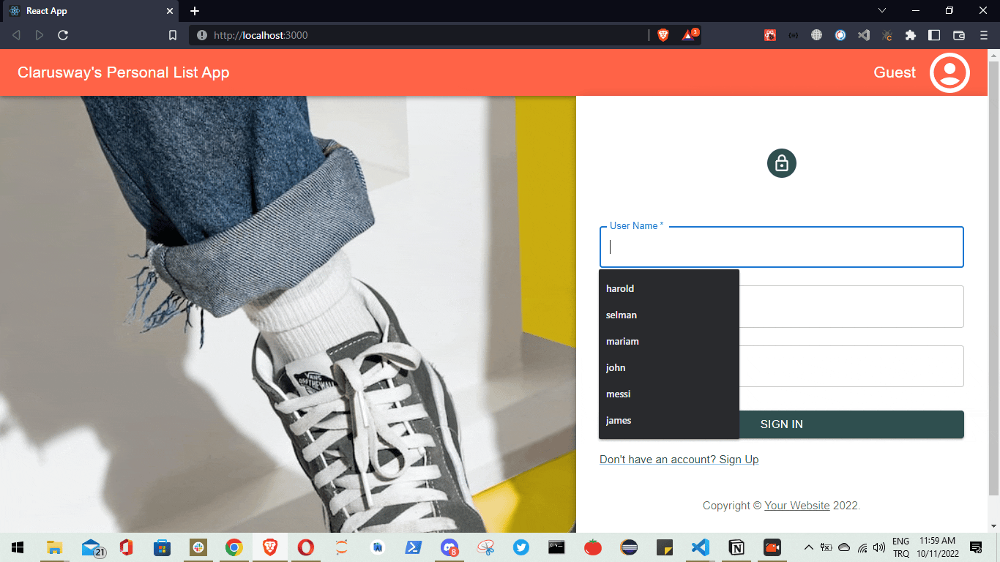

# Full Stack Project Personal List App- Backend

```
# KURULUM KOMUTLARI
   1 py -m venv env
   2 .\env\Scripts\activate
   3 pip install djangorestframework
   4 pip install dj-rest-auth
   5 django-admin startproject main .
   6 pip install python-decouple
   7 py manage.py migrate
   8 py manage.py createsuperuser
   9 py manage.py startapp users
```

## How To Use Repo

<!-- This is an example, please update according to your application -->

To clone and run this application, you'll need [Git](https://git-scm.com)

```bash

# Clone this repository
$ git clone https://github.com/anthonyharold67/personalAppBackend-ch11.git

# Install dependencies
    $ python -m venv env
    > env/Scripts/activate (for win OS)
    $ source env/bin/activate (for macOs/linux OS)
    $ pip install -r requirements.txt

# Edit .backend.env to .env

# Add SECRET_KEY in .env file

# Run the app
    $ python manage.py runserver
```

### Expected

<ul>
    <li>Deparment ve Personal tablolarımız olacak bunları birbirlerine bağlayacağız. .her deparmentın altında kendisine ait personeller olacak.</li>
    <li>Full stack proje sonunda login olan şirket personeli şirketin deparmentlarını ve o deparmentların altında çalışan personelleri detaylı bir şekilde görebilcek.</li>
    <li>Staff olan personeller yeni personel listeye ekleyebilecek, update edebilecek.</li>
    <li>Personal modelimizde is_staffed seçeneği olacak. Bu seçenek true olarak db ye gelirse kullanıcının first ve last nameine göre User tablosunda sorgulama yapıp kullanıcı varsa eşleşiyorsa o personelin User tablasoundaki bilgilerinden is_staff özelliğini true yapacağız.Ama yoksa personelin is_staffed değerini false olarak kaydedeceğiz.</li>
    <li>Personeli silme yetkisi sadece superuserlarda olacak.</li>
    <li>Bu yapıyı generic view kullanarak yapacağız. Class metotlarını override etme maksadıyla kişinin staff veya superuser olup olmadığını ona göre işlem yapması gerektiğini if-else yapılarıyla sağlayacağız. Rest framework permissionlarından IsAuthenticated ı kullanacağız. </li>
    <li>Serializerımızda nested serializer ve methodfieldları kullancağız.</li>
    <li>Token authentication kullanacağız. Kullanıcı logout olduğunda tokeni sileceğiz.</li>
    <li>Frontend kısmını apimize bağlayabilmek için cors-headers paketini kullanacağız</li>
</ul>
<a href="https://github.com/adamchainz/django-cors-headers">Cors Headers paketi için</a>


### Frontend Output


